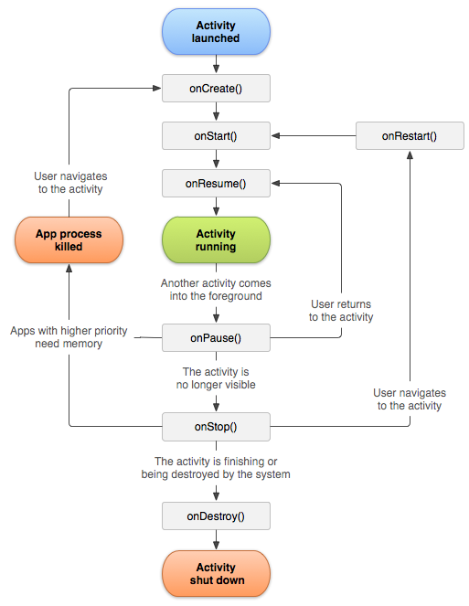

# Activity

- 안드로이드 앱에서 화면을 구성하고 사용자와 상호 작용하는 데 사용되는 기본 구성 요소
- View이다
- Activity,ComponentActivity 클래스를 상속받아서 구현한다

# activity lifecycle

- 사용자가 앱을 사용하는 과정에서
    - 앱의 Activity 인스턴스는 수명 주기 안에서 서로 다른 상태를 통해 전환된다
    - Activity,ComponentActivity,AppCompatActivity 클래스는 상태가 변경되는것을 액티비티에 알리는 여러 콜백을 제공한다

# Activity-lifecycle concepts(액티비티 생명주기 개념)

- 활동 수명 주기의 단계 간 전환을 탐색하기 위해 Activity 클래스는
    - onCreate(), onStart(), onResume(), onPause(), onStop(), onDestroy() 6가지 콜백을 제공한다
- 활동이 새 상태로 전환될 때 안드로이드 시스템은 이러한 각 콜백을 호출해서 Activity에 상태변화를 알려준다

## 재공하는 콜백

### onCreate()

- 액티비티의 시작
- 안드로이드 시스템이 Activity를 생성할 때 실행되는 것
- 필수적으로 구현해야 한다
- 필수적으로 savedInstanceState매개변수를 주입해야한다
    - savedInstanceState란
        - Bundle 액티비티나 프래그먼트의 상태를 저장하고 복원하기 위해 사용되는 객체이다
- 필수적으로 view(xml,compose)를 연결해야한다

##### 하는일

- 액티비티의 초기화 및 설정 작업을 수행함
    - 예시로
        - 액티비티를 viewModel에 연결한다
        - Activity의 변수를 인스턴스화 한다
        - view를 연결한다

### onStart()

- onCreate 실행후에 시스템이 자동으로 호출한다
    - 사용자에게 보여지는 시점의 직전에 호출

##### 하는일

- UI를 유지하는 코드 초기화
- 화면에 보이기 전에 필요한 초기화 작업을 수행한다

### onResume()

- onStart 실행후에 시스템이 자동으로 호출한다
    - 사용자와 상호작용할 수 있는 상태가 되었을 때 호출
        - 많은 앱 기능들이 활성화된다
        - Activity가 완전한 상태이다

##### 하는일

- 사용자가 사용해야하늠 모든 기능을 활성화 시킨다

### onPause()

- 사용자가 액티비티를 떠날때 호출
- 상호작용이 불가능할때 호출
- 액티비티가 가려졌을때 호출

##### 하는일

- 더이상 Activity가 안보이므로 UI에 관련된 작업을 멈춘다
- 자원을 많이 사용하는 작업을 정지한다
- 진행하던 작업의 상태를 저장한다
- UI관련 리소스를 해제한다

### onStop()

- 액티비티가 완전히 사용자에게 안보일때 호출

##### 하는일

- 액티비티가 사용하고있던 리소스 할당을 해재하거나 작업을 중단한다
- 화면에 보이지 않을 때 실행할 필요가 없는 기능을 모두 정지한다
- CPU를 비교적 많이 사용하는 종료 작업을 실행합

### onDestroy()

- 액티비티의 끝
    - 액티비티가 소멸될 때 호출
        - 액티비티가 사용하던 리소스할당을 해제하거나 액티비티가 메모리에서 완전히 삭제된다

### onRestart

- 액티비티가 중지되었다가 다시 시작되기 직전에 호출
    - onStop시점에 할당 해제했던 리소스를 다시 할당하거나 중단한 작업을 재개한다

#### 대략적인 흐름



### Activity클래스의 콜백

- Activity클래스들은 여러가지 콜백을 재공하는데
    - 이런 콜백들을 이용해서
        - Activity가 Activity 수명주기마다 어떤식으로 작동할지 선언할수 있다
        - 이런 콜백들을 잘 활용하면 앱의 성능을 끌어올릴수 있다

```kt
class MainActivity : AppCompatActivity() {

    override fun onCreate(savedInstanceState: Bundle?) {
        super.onCreate(savedInstanceState)
        setContentView(R.layout.activity_main)
        Log.d("Lifecycle", "onCreate")
    }

    override fun onStart() {
        super.onStart()
        Log.d("Lifecycle", "onStart")
    }

    override fun onResume() {
        super.onResume()
        Log.d("Lifecycle", "onResume")
    }

    override fun onPause() {
        super.onPause()
        Log.d("Lifecycle", "onPause")
    }

    override fun onStop() {
        super.onStop()
        Log.d("Lifecycle", "onStop")
    }

    override fun onDestroy() {
        super.onDestroy()
        Log.d("Lifecycle", "onDestroy")
    }

    override fun onRestart() {
        super.onRestart()
        Log.d("Lifecycle", "onRestart")
    }
}
```

[res](https://developer.android.com/guide/components/activities/activity-lifecycle?hl=ko)