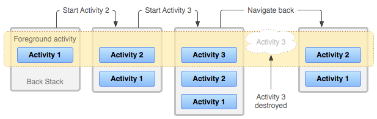
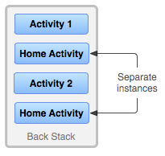

# Tasks and BackStack

### Tasks

- Activity들을 기록하고 관리하는 Stack
- Tasks는 액티비티의 스택을 가지고 있으며, 이를 해당 작업의 백 스택이라고 한다

### stack

- 액티비티는 onCreate된 순서대로 Stack에 저장된다
    - 새로운 Activity가 시작되면 스택의 맨 위에 배치되어 실행 중인 활동이 되며, 이전 Activity는 일시 중지되고 백 스택에 넣어진다
    - 뒤로 가기 버튼을 누르면 현재 활동이 파괴되고 스택의 맨 위에 있는 Activity가 다시 활성화된다
    - 안드로이드는 이 백 스택 개념을 사용하여 Tasks와 Activity 간의 탐색 방법을 정의한다

- 사용자가 앱의 바로가기를 탭하면 앱의 tasks에 있는 Activity가 화면에 띄워지고 (포커스를 가지고)
- 만약 앱의 액티비티가 없으면 mainActivity를 tasks에 넣고 화면에 띄운다(포커스를 가진다)

# Background and foreground tasks

- tasks는 사용자가 다른앱을 켜거나(새로운 tasks를 만들거나) 홈화면으로 이동할때
    - 인스턴스가 백그라운드로 이동할수 있다
        - 백그라운드로 이동하면 tasks의 모든 Activity는 중지되지만 다음에 다시 tasks로 돌아와서 Activity의 백스택은 유지된다
        - 백그라운드로 이동하면 tasks는 포커스를 잃는다
        - 다시 tasks로 돌아왔을때 사용자가 진행하던 부분에서 이어서 진행할수 있다

# Multiple activity instances

- tasks의 Activity는 정렬되지 않아서
  
- 그림처럼 한Activity(인스턴스)가 tasks에 여러개 존재할수 있다
- 각 Activity는 각각의 UI상태를 가진다