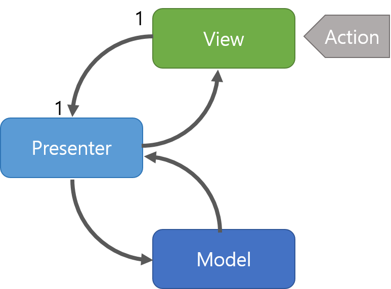

# MVP

- 정의
    - Model-View-Presenter의 약자

- MVC를 기반으로한 아키텍처

- 모델: 데이터와 비즈니스 로직을 관리한다
- 뷰: 레이아웃과 화면을 처리한다
- 프테젠터: 모델에 명령을 전달하고 모델에 있는 데이터를 view에 전달한다

### MVC와 다른점

- Model과 view의 의존성이 없다
    - Model과 view가 연결 돼있지 않다
- Presenter 과 view의 관계가 1 : 1이다
- Presenter 가 view를 직접 업데이트한다

# 단점 

- View와 Presenter 사이의 의존성이 너무 강하다