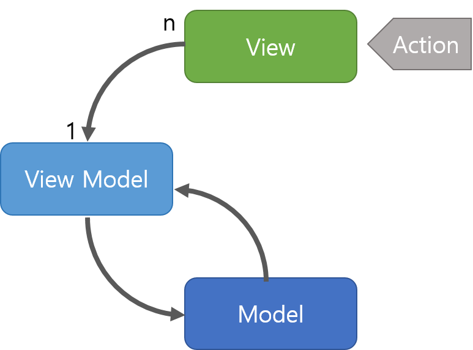

# MVVM

- 정의
    - Model-View-ViewModel 의 약자

- MVC, MVP 를 기반으로한 아키텍처

- 모델: 데이터와 비즈니스 로직을 관리한다
- 뷰: 레이아웃과 화면을 처리한다
- 프테젠터: 모델에 명령을 전달한다, 그리고 model의 데이터를저장해서 view에 비동기적으로 업데이트할 수 있도록 해준다

### MVP와 다른점

- ViewModel과 View의 관계가 m : n이다
- model에서 데이터를 가져와서 viewModel에 저장한다
- view가 viewModel의 데이터를 구독한다(옵저버 패턴)
- viewModel이 직접 view를 업데이트하지 않는다

# 단점

- 어렵다
    - 배우기
    - 사용하기