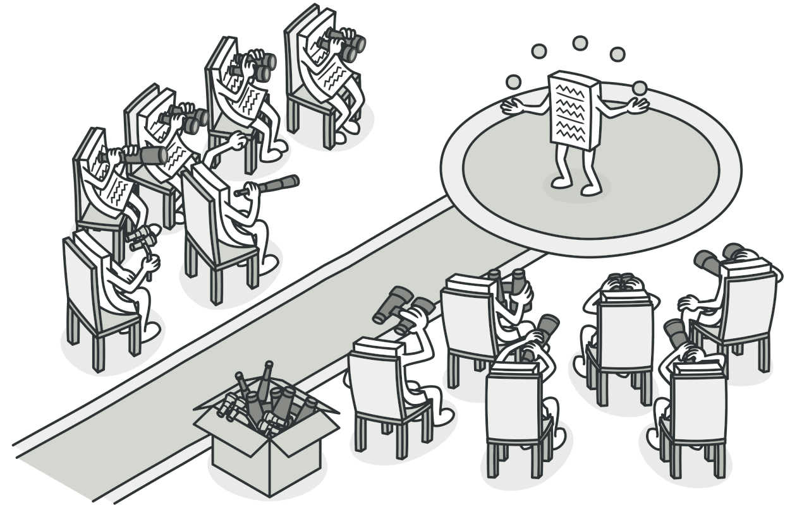

# Observer Pattern

- 여러 객체에 그 객체가 관찰 중인 객체에 발생하는 모든 이벤트에 대하여 알리는 구독 메커니즘을 사용한다
- 객체 간의 일대다 종속성을 정의하여 한 객체의 상태가 변경될 때 그 객체를 관찰하는 다른 객체들이 자동으로 알림을 받고 이를 처리할 수 있는 디자인 패턴



# 구조

- Observer가 Subject를 구독한다(관찰한다)
- Subject에 변화가 생기면 Subject가 Observer로 알림을 전달한다
- 알림과동시에 Observer의 데이터를 업데이트한다

```kt
// 주제(Subject) 인터페이스
interface Subject {
    fun registerObserver(observer: Observer)
    fun notifyObservers()
}

// 옵저버(Observer) 인터페이스
interface Observer {
    fun update(data: Any)
}

// 구체적인 주제 클래스
class ConcreteSubject : Subject {
    private val observers = mutableListOf<Observer>()
    private var data: Any? = null

    override fun registerObserver(observer: Observer) {
        observers.add(observer)
    }

    override fun notifyObservers() {
        for (observer in observers) {
            observer.update(data!!)
        }
    }

    fun setData(data: Any) {
        this.data = data
        notifyObservers()
    }
}

// 구체적인 옵저버 클래스
class ConcreteObserver(private val name: String) : Observer {
    override fun update(data: Any) {
        println("$name received data: $data")
    }
}

// 사용 예제
fun main() {
    val subject = ConcreteSubject()
    val observer1 = ConcreteObserver("Observer 1")
    val observer2 = ConcreteObserver("Observer 2")

    // 옵저버 등록
    subject.registerObserver(observer1)
    subject.registerObserver(observer2)

    // 주제에 데이터 설정 및 옵저버들에게 통지
    subject.setData("Hello, observers!")
}
```

# 특징

- 원하는 객체(Observer)만 객체(Subject)의 변경사항을 알수 있다
- 객체가 변했을때 알림(Notify)을 전달받으니까 객체가 변했는지 확인할 필요가 없다
- 단방성이다

# 장점

- 주제와 옵저버 간의 관계가 느슨하게 결합되어 있다
- 이벤트 기반(Event-Driven):
    - 옵저버 패턴은 이벤트 기반의 프로그래밍 모델을 제공한다
        - 이는 **비동기적인** 상태 변경에 대응할 수 있으며, 다양한 이벤트 핸들링에 유용하다