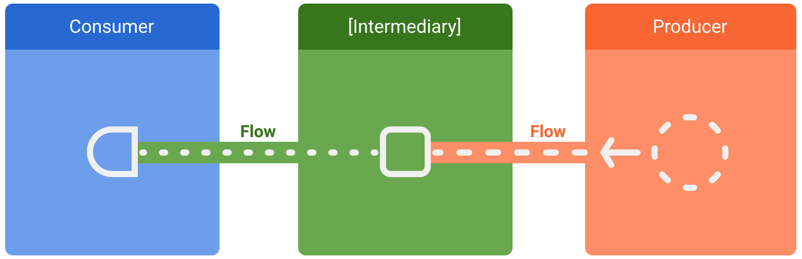

# Flow

- Kotlin 코루틴 라이브러리의 일부인 type 이다
    - 그래서 코루틴 과 같이 쓰기 편하다
- 옵저버 패턴을 따르는 타입 이다

# 특징

- Flow 는 여러 값을 순차적 으로 방출할 수 있다
- 데이터 스트림 이나 비동기 의 이벤트 스트림 을 다루기 편하다
- 옵저버 패턴을 따른다
- 백 프레셔 핸들링 을 내장 하고 있다
- 연속적 으로 변환, 필터링 또는 결합할 수 있다
- 코루틴 과 함께 사용 된다

# 구성 요소



- producer(데이터 생산자)
- Intermediaries(중개자)
- consumer(데이터 소비자)

### 보통

- 안드로이드 에선 repository 가 producer 이다
- 그리고 UI가 consumer 이다
- 그리고 그 중간 층인 ViewModel, UseCase 가 Intermediaries 이다
    - Intermediaries 는 중간 에서 값을 수정 한다

# 사용

### 생성

```kotlin
interface SomeApi {
    suspend fun getSomeData(): List<SomeData> // 반환값 List
}

val exFlow = flow { // flow builder
    repeat(10) { // 10번 반복 
        emit(SomeApi.getSomeData) // 비동기 작업 데이를 flowData 로 방출 한다
        delay(2000) // 코루틴 을 2초동안 일시 정지
    }
}
```

- = flow{ .. }
    - 부분은 Flow 를 생성 하는 빌더 블록 이다
- emit()
    - 부분은 발행 이라는 뜻으로 Flow 타입의 데이터 를 방출 하는 부분 이다

### 수정

```kotlin
val originalFlow: Flow<Int> = ...
val modifiedFlow: Flow<String> = originalFlow
    .map { it * 2 } // 각각의 요소를 2배로 변환
    .filter { it > 10 } // 값이 10보다 큰 요소만 을 스트림 에 포함
    .map { "Number: $it" } // 각 요소를 "Number: "를 접두사 로 하는 문자 열로 변환
```

- 수정은
    - map: 각각의 요소를 다른 형태로 변환 한다
    - filter: 조건을 만족 하는 요소만 스트림 에 포함 시킨다
    - map: 각 요소를 다른 Flow 로 변환 한다
    - reduce: 모든 요소를 하나의 값으로 줄인다
- 같은 확장 함수를 사용 하여 구현 한다

### 데이터 소비

```kotlin
viewModelScope.launch {
    // collect(데이터 수집)은 코루틴 안에서 실행 해야 한다
    ExFlowData.collect { exData ->
        println("exData : $exData")
    }
}
```

- 데이터 소비는 코루틴 안에서 실행 해야 하고
    - 데이터 소비는
        - .toList()
        - .toSet()
        - .collect{}
        - .reduce()
    - 등 많은 flow 확장 함수로 소비할 수 있다

### 예외 처리

- flow 에서 예외 처리는 catch 연산자 로 한다
  - flow 에서는 예외가 생겨도 하던 동작을 완전히 멈추지 않고 catch{ } 안의 작업을 실행 하고
    - 하던 동작을 이어서 진행 한다